---
# 📝 Task Manager (Flutter)


> A modern **Todo App** built with **Flutter**, designed to help users organize, track, and complete tasks with an intuitive interface and smooth performance.

---

## 🌟 Overview

**Task Manager** is a user-friendly mobile application that allows users to manage daily tasks efficiently.  
It supports creating, updating, and deleting tasks with status tracking, along with user authentication and profile management.

---

## ✨ Features

✅ **Create Tasks** — Add new todos with custom details  
🔁 **Update Task Status** — Change status to **New**, **In Progress**, **Completed**, or **Cancelled**  
❌ **Delete Tasks** — Remove completed or unnecessary todos  
🔐 **User Authentication** — Login, create an account, and reset password  
🧑‍💼 **Profile Management** — Edit profile and view user details  
💾 **Local Storage** — Store user info using `SharedPreferences`  
🌐 **API Integration** — Fetch and update data through RESTful API  
🎨 **Beautiful UI** — Built with Flutter’s modern design widgets  
💡 **Persistent Sessions** — Keep users logged in seamlessly  

---

## 🧩 Tech Stack & Packages

| Category | Technologies / Packages |
|-----------|--------------------------|
| **Framework** | Flutter |
| **Language** | Dart |
| **State Management** | Provider |
| **Local Storage** | SharedPreferences |
| **Network Calls** | HTTP |
| **UI Assets** | Flutter SVG |
| **Pin Input Fields** | Pinput |
| **IDE** | VS Code |

---

## ⚙️ Installation & Setup

1. **Clone this repository**
   ```bash
   git clone https://github.com/rahimuj570/Task_Manager_Flutter.git
   ```

2. **Navigate into the folder**

   ```bash
   cd Task_Manager_Flutter
   ```

3. **Install dependencies**

   ```bash
   flutter pub get
   ```

4. **Run the app**

   ```bash
   flutter run
   ```

---

## 🧱 Folder Structure (Simplified)

```
lib/
 ├── data/
 │   ├── models/
 │   ├── services/
 │   └── utils/
 ├── ui/
 │   ├── controllers/
 │   ├── screens/
 │   └── widgets/
 ├── main.dart
 └── ...
```

---

## 📸 Screenshots

| Screen                                      | Preview                                                  |
| ------------------------------------------- | -------------------------------------------------------- |
| 🏠 **Splash Screen**                        | 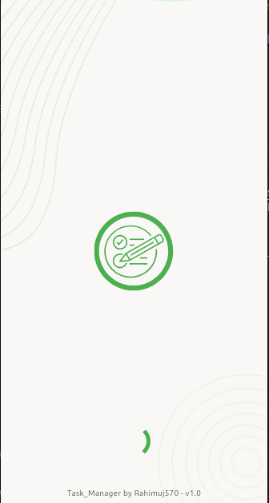          |
| 🔐 **Login Screen**                         | 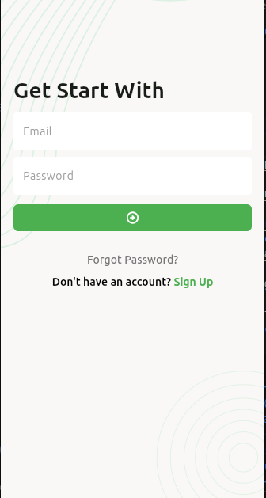            |
| 🆕 **Register Screen**                      | 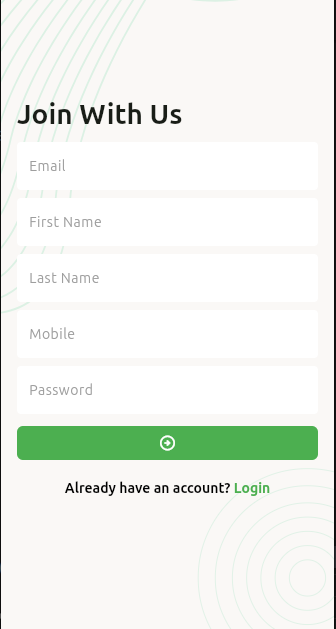      |
| 🔑 **Forgot / Reset Password Screen (verify email)**       | 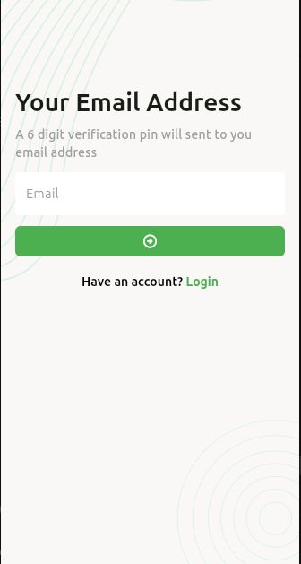 |
| 🔑 **Forgot / Reset Password Screen (Verify PIN)**       | 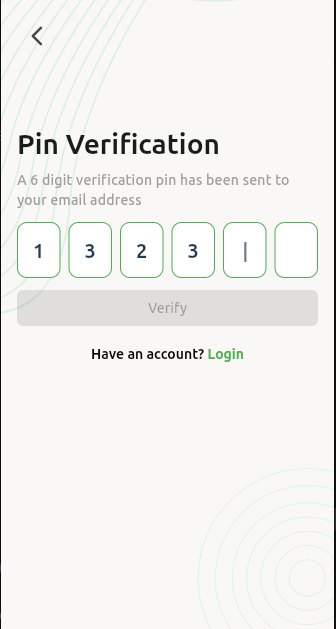 |
| 🔑 **Forgot / Reset Password Screen**       | 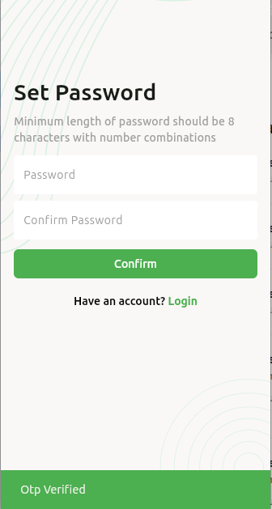 |
| 🏡 **Home Screen (Dashboard)**              | 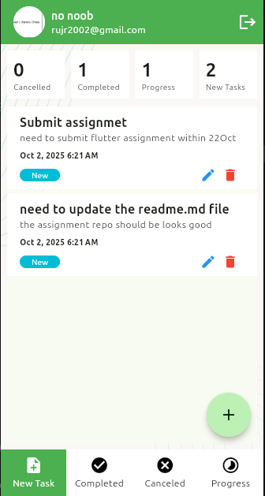              |
| 🗒️ **Create Task Screen**                  | 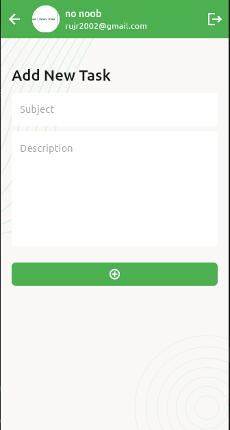       |
| 🔄 **Update / Edit Task Screen**            | 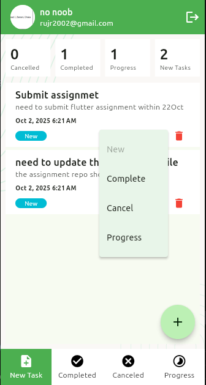           |
| 📋 **Task List Screen**                     |            |
| 📊 **Task Status Filter / Progress Screen** | 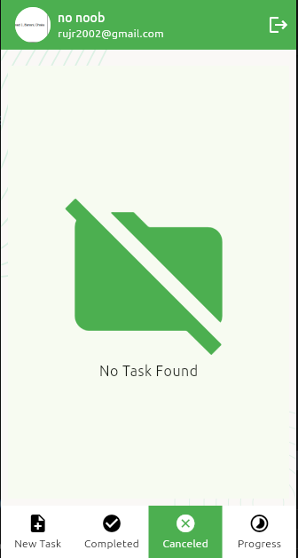          |
| 👤 **Profile Screen**                       |                |
| ⚙️ **Edit Profile Screen**                  | 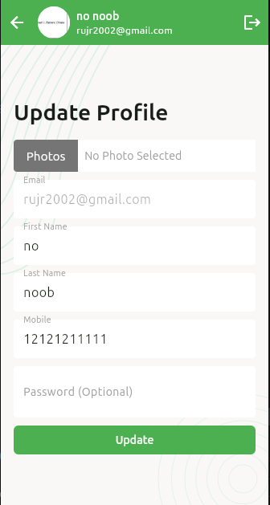     |
| ⚓ **Navigation Drawer / Bottom Nav**        |          |


---

## 🤝 Contributing

Contributions are welcome!
If you'd like to improve this app, feel free to:

* 🐛 Report bugs
* 💡 Suggest new features
* 🔧 Submit pull requests

---

## 👨‍💻 Author

**Developed by:** [Rahimujjaman Rahim](https://github.com/rahimuj570)
💙 *Crafted with Flutter and passion.*

---

## 🪪 License

This project is licensed under the **MIT License** — see the [LICENSE](LICENSE) file for details.

---

⭐ **If you like this project, don’t forget to give it a star on GitHub!**
---

